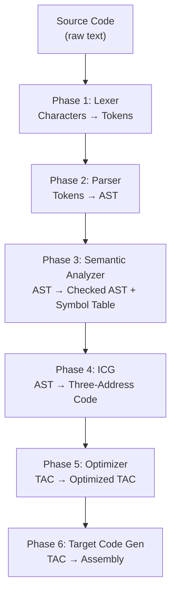

# CompilerViz — Complete Code Walkthrough

## Overview

CompilerViz is a **Java Swing desktop application** that visualizes the **6 phases of a compiler**. You paste C-like source code into the editor, click **Compile**, and the app shows you what happens at each stage — from raw characters to machine-level assembly.

---

## How to Compile and Run

```
# Step 1: Compile all Java source files
javac -d out src\compiler\*.java

# Step 2: Run the application
java -cp out compiler.Main
```

Or simply use the provided batch files:
- `compile.bat` — compiles everything into the `out/` directory
- `run.bat` — launches the GUI

---

## Project Structure

```
e:\Compiler_Project\
  src\compiler\
    Token.java              ← Token types & categories
    Lexer.java              ← Phase 1: Lexical Analysis
    ASTNode.java            ← AST node definitions
    Parser.java             ← Phase 2: Syntax Analysis
    SemanticAnalyzer.java   ← Phase 3: Semantic Analysis
    IntermediateCodeGen.java← Phase 4: Intermediate Code Generation
    CodeOptimizer.java      ← Phase 5: Code Optimization
    TargetCodeGen.java      ← Phase 6: Target Code Generation
    TreePanel.java          ← Visual tree drawing (Swing)
    CompilerUI.java         ← Main GUI (tabs, editor, buttons)
    Main.java               ← Entry point
```

---

## File-by-File Explanation

---

### 1. [Token.java](file:///e:/Compiler_Project/src/compiler/Token.java) — The Token Class

**Purpose:** Defines what a "token" is. A token is the smallest meaningful unit of source code.

**How it works:**

- The `Type` enum lists every possible token type the compiler recognizes:
  - **Keywords:** `int`, `float`, `char`, `if`, `else`, `while`, `for`, `printf`, `print`, `return`
  - **Literals:** `INTEGER_LITERAL` (e.g., `42`), `FLOAT_LITERAL` (e.g., `3.14`), `STRING_LITERAL` (e.g., `"hello"`), `CHAR_LITERAL` (e.g., `'A'`)
  - **Operators:** `+`, `-`, `*`, `/`, `%`, `=`, `==`, `!=`, `<`, `>`, `<=`, `>=`, `&&`, `||`, `!`, `++`, `--`, `+=`, `-=`, `*=`, `/=`
  - **Brackets:** `(`, `)`, `{`, `}`, `[`, `]`
  - **Special Characters:** `;`, `,`, string literals, char literals, preprocessor directives
  - **Special:** `EOF` (end of file), `ERROR` (unrecognized character)

- Each token stores three things:
  - `type` — what kind of token (from the enum)
  - `value` — the actual text (e.g., `"while"`, `"42"`, `"++"`)
  - `line` — which line number it appeared on

- `getCategory()` classifies tokens into human-readable groups shown in the UI table:
  - `+`, `=`, `*` → **Operator**
  - `(`, `)` → **Bracket**
  - `;`, `,`, `""`, `''` → **Special Character**
  - `int`, `for` → **Keyword**
  - variable names → **Identifier**
  - numbers → **Literal**

---

### 2. [Lexer.java](file:///e:/Compiler_Project/src/compiler/Lexer.java) — Phase 1: Lexical Analysis

**Purpose:** Reads the raw source code character-by-character and breaks it into a list of tokens.

**How it works:**

1. **Main loop** (`tokenize()`): Iterates through every character in the source string. For each character, it decides what kind of token starts here and calls the appropriate scanner method.

2. **Whitespace & Comments** (`skipWhitespaceAndComments()`): Skips spaces, tabs, newlines, single-line comments (`// ...`), and multi-line comments (`/* ... */`). Tracks line numbers for error reporting.

3. **Preprocessor** (`scanPreprocessor()`): When it sees `#`, it reads the entire line (e.g., `#include <stdio.h>`) as a single `PREPROCESSOR` token. This lets the compiler recognize C headers without needing to process them.

4. **String Literals** (`scanStringLiteral()`): When it sees `"`, it reads everything until the closing `"`. Handles escape sequences like `\n` (newline), `\t` (tab), `\\` (backslash), `\"` (quote) — these are kept as-is in the token value.

5. **Char Literals** (`scanCharLiteral()`): When it sees `'`, reads a single character (or escape sequence) and the closing `'`.

6. **Identifiers & Keywords** (`scanIdentifier()`): When it sees a letter or underscore, reads the full word. Then checks if it's a keyword (like `int`, `for`, `while`) or a regular identifier (variable name).

7. **Numbers** (`scanNumber()`): When it sees a digit, reads the full number. If there's a `.` followed by more digits, it's a float literal; otherwise an integer literal.

8. **Operators** (`scanOperator()`): Handles single-char operators (`+`, `-`, `(`, `;`) and multi-char operators (`++`, `--`, `==`, `!=`, `<=`, `>=`, `&&`, `||`, `+=`, `-=`, `*=`, `/=`). For multi-char operators, it peeks at the next character to decide.

**Example:** Input `int i = 5;` produces:
```
<INT, int, line:1>  <IDENTIFIER, i, line:1>  <ASSIGN, =, line:1>  <INTEGER_LITERAL, 5, line:1>  <SEMICOLON, ;, line:1>
```

---

### 3. [ASTNode.java](file:///e:/Compiler_Project/src/compiler/ASTNode.java) — Abstract Syntax Tree Nodes

**Purpose:** Defines the building blocks of the parse tree. Each node represents a construct in the source code.

**How it works:**

- The `NodeType` enum lists all possible node types:
  - `PROGRAM` — root node containing all top-level statements
  - `VAR_DECL` — variable declaration (e.g., `int x = 5`)
  - `ASSIGN` — assignment (e.g., `x = 10`)
  - `IF`, `WHILE`, `FOR` — control flow
  - `PRINTF`, `PRINT`, `RETURN` — output and return statements
  - `BINARY_OP` — operations like `a + b`, `x == y`
  - `POST_INCREMENT`, `POST_DECREMENT` — `i++`, `i--`
  - `COMPOUND_ASSIGN` — `x += 5`, `num /= 10`
  - `FUNCTION_DEF` — `int main() { ... }`

- Each node has:
  - `type` — what kind of node
  - `value` — associated value (operator symbol, variable name, literal value)
  - `dataType` — for declarations, the declared type (`int`, `float`, `char`)
  - `name` — for variables/functions, the name
  - `children` — child nodes (e.g., an `IF` node has children: condition, then-block, else-block)
  - `inferredType` — set by semantic analysis (what type does this expression evaluate to?)

- **Factory methods** like `ASTNode.ifNode()`, `ASTNode.binaryOp("+")` create nodes cleanly.

- `toTreeString()` produces a text representation for display.

---

### 4. [Parser.java](file:///e:/Compiler_Project/src/compiler/Parser.java) — Phase 2: Syntax Analysis

**Purpose:** Takes the flat list of tokens from the Lexer and builds a hierarchical Abstract Syntax Tree (AST) using **recursive descent parsing**.

**How it works:**

The parser implements a **top-down recursive descent** strategy. Each grammar rule becomes a method:

1. **`parse()`** — Entry point. Loops through tokens, recognizing:
   - Preprocessor directives (skip them, add to AST)
   - Function definitions (`int main() { ... }`)
   - Standalone statements

2. **`parseStatement()`** — Dispatches based on the current token:
   - Sees `int`/`float`/`char` → `parseVarDecl()`
   - Sees `if` → `parseIf()`
   - Sees `while` → `parseWhile()`
   - Sees `for` → `parseFor()`
   - Sees `printf` → `parsePrintf()`
   - Sees identifier → `parseIdentifierStatement()` (assignment, `i++`, `i--`, `x /= 10`)

3. **`parseVarDecl()`** — Handles:
   - Single: `int x = 5;`
   - Multiple: `int i, j, n = 5;` (comma-separated)
   - Uninitialized: `int i;` (defaults to 0)

4. **`parseFor()`** — Parses `for(init; cond; update) body`:
   - Init can be a declaration, assignment, or empty
   - Condition is an expression
   - Update can be `i++`, `i--`, compound assignment, or assignment
   - Body can be a block `{...}` or a single statement

5. **`parseStmtOrBlock()`** — Key method that allows `if`/`else`/`while`/`for` to have either `{ block }` or a single statement as body (like real C).

6. **Expression parsing** uses **precedence climbing**:
   - `parseLogicalOr()` → `||` (lowest precedence)
   - `parseLogicalAnd()` → `&&`
   - `parseComparison()` → `==`, `!=`, `<`, `>`, `<=`, `>=`
   - `parseAddition()` → `+`, `-`
   - `parseMultiplication()` → `*`, `/`, `%`
   - `parseUnary()` → `-x`, `!x`
   - `parsePrimary()` → numbers, identifiers, `(expr)`, `i++`, `i--` (highest precedence)

7. **Error recovery** (`synchronize()`): If a parse error occurs, the parser skips tokens until it finds a semicolon or keyword, then continues parsing. This way one error doesn't prevent the rest from being analyzed.

---

### 5. [SemanticAnalyzer.java](file:///e:/Compiler_Project/src/compiler/SemanticAnalyzer.java) — Phase 3: Semantic Analysis

**Purpose:** Walks the AST and checks for **meaning errors** — things that are syntactically valid but logically wrong.

**How it works:**

1. **Symbol Table**: Maintains a stack of scopes (using `Deque<Map>`). Each scope maps variable names to their type, scope label, and line number.

2. **Scope Management**:
   - `enterScope("if_then")` — pushes a new scope onto the stack
   - `exitScope()` — pops the scope
   - `declare("x", "int", 5)` — adds a variable to the current scope
   - `lookup("x")` — searches all scopes from innermost to outermost

3. **Checks performed**:
   - **Undeclared variables**: If you use `x` without declaring it first → ERROR
   - **Duplicate declarations**: If you declare `int x` twice in the same scope → ERROR
   - **Type mismatches**: If you assign a float to an int variable → WARNING
   - **Type inference**: Determines what type each expression evaluates to (e.g., `int + float` → `float`)

4. **Output**: Produces a **symbol table** (name, type, scope, line) and lists of errors/warnings.

**Example:** For `int x = 5; y = 10;`:
- `x` is declared → added to symbol table
- `y` is used without declaration → ERROR: "Variable 'y' used before declaration"

---

### 6. [IntermediateCodeGen.java](file:///e:/Compiler_Project/src/compiler/IntermediateCodeGen.java) — Phase 4: Intermediate Code Generation

**Purpose:** Converts the AST into **Three-Address Code (TAC)** — a simple, linear instruction format where each instruction has at most three operands.

**How it works:**

1. **Temporary variables** (`t0`, `t1`, `t2`, ...): Complex expressions are broken into simple steps using temporaries.

2. **Labels** (`L0`, `L1`, ...): Used for control flow (jumps).

3. **Translation rules**:
   - `int x = a + b * 2` becomes:
     ```
     t0 = b * 2
     t1 = a + t0
     x = t1
     ```
   - `if (cond) { ... } else { ... }` becomes:
     ```
     if_false cond goto L0
     ... then block ...
     goto L1
     L0:
     ... else block ...
     L1:
     ```
   - `for(i=0; i<n; i++) { body }` becomes:
     ```
     i = 0
     L0:
     t0 = i < n
     if_false t0 goto L1
     ... body ...
     i = i + 1
     goto L0
     L1:
     ```
   - `printf("format", arg1, arg2)` becomes:
     ```
     param "format"
     param arg1
     param arg2
     call printf
     ```
   - `i++` becomes: `i = i + 1`

---

### 7. [CodeOptimizer.java](file:///e:/Compiler_Project/src/compiler/CodeOptimizer.java) — Phase 5: Code Optimization

**Purpose:** Improves the TAC to make it faster/smaller without changing behavior.

**How it works (4 optimization passes):**

1. **Constant Folding**: If both operands are constants, compute the result at compile time.
   - `t0 = 3 + 7` → `t0 = 10`

2. **Constant Propagation**: If a variable holds a known constant, substitute it everywhere.
   - `x = 5; y = x + 3` → `y = 5 + 3` → `y = 8` (then folds again)

3. **Strength Reduction**: Replace expensive operations with cheaper ones.
   - `x * 2` → `x + x` (addition is faster than multiplication)
   - `x * 0` → `0`
   - `x * 1` → `x`
   - `x + 0` → `x`

4. **Dead Code Elimination**: Remove temporary variables that are computed but never used by any other instruction.

The optimizer makes a deep copy of the original TAC first, so both "before" and "after" can be displayed side-by-side.

---

### 8. [TargetCodeGen.java](file:///e:/Compiler_Project/src/compiler/TargetCodeGen.java) — Phase 6: Target Code Generation

**Purpose:** Translates optimized TAC into **x86-like assembly instructions** with register allocation.

**How it works:**

1. **Register Allocation**: Maps variables/temporaries to registers `R0`-`R7`. When registers run out, it spills to memory (`MEM[var]`).

2. **Instruction mapping**:
   | TAC | Assembly |
   |---|---|
   | `x = 5` | `MOV R0, #5` |
   | `t0 = a + b` | `MOV R2, R0` then `ADD R2, R1` |
   | `t0 = a % b` | `MOV R2, R0` then `MOD R2, R1` |
   | `if_false t0 goto L1` | `CMP R2, #0` then `JE L1` |
   | `goto L0` | `JMP L0` |
   | `print x` | `PUSH R0` then `CALL _print` |
   | `i++` | `INC R0` |
   | `return 0` | `MOV R0, #0` then `RET` |

3. **Output** includes a register allocation map showing which variable is in which register.

---

### 9. [TreePanel.java](file:///e:/Compiler_Project/src/compiler/TreePanel.java) — Visual Tree Drawing

**Purpose:** A custom Swing JPanel that draws the AST as a graphical tree with nodes and connecting lines.

**How it works:**

1. **Layout computation** (`computeWidth`, `computeHeight`): Recursively calculates how much space each subtree needs. Leaf nodes get minimum width; parent nodes are as wide as the sum of their children.

2. **Node positioning** (`layoutNode`): Centers each node above its children, distributing children horizontally across the available width.

3. **Drawing** (`paintComponent`): Uses Java2D graphics to:
   - Draw connecting lines between parent and child nodes
   - Draw rounded rectangles for each node (light blue fill, dark blue border)
   - Draw the label text centered inside each node

---

### 10. [CompilerUI.java](file:///e:/Compiler_Project/src/compiler/CompilerUI.java) — Main GUI

**Purpose:** The main application window with the code editor, tab panels, and compile button.

**How it works:**

1. **Layout**: `BorderLayout` with header (top), split pane (center), footer (bottom).
   - Left side: code editor (JTextArea)
   - Right side: 6 tabs, one per compiler phase

2. **Compile pipeline** (`compile()`): The core method that chains all 6 phases:
   - Phase 1 → fills token table
   - Phase 2 → draws parse tree + text representation
   - Phase 3 → fills symbol table + errors/warnings
   - Phase 4 → displays Three-Address Code
   - Phase 5 → shows original vs. optimized TAC side-by-side
   - Phase 6 → displays assembly code
   - If any phase finds errors, it **stops** and doesn't proceed to later phases

3. **Error handling**: Each phase checks for errors. If errors exist, the status bar turns red and subsequent phases are skipped (no output).

---

### 11. [Main.java](file:///e:/Compiler_Project/src/compiler/Main.java) — Entry Point

**Purpose:** Sets up the look-and-feel and launches the UI.

**How it works:** Sets UI defaults (colors for tabs, panels, scrollbars) for the light theme, then creates the `CompilerUI` frame on the Swing event dispatch thread using `SwingUtilities.invokeLater()`.

---

## Compilation Pipeline Flow



At each phase, if **errors are detected**, the pipeline **stops** and shows the errors. Only clean code proceeds through all 6 phases.
